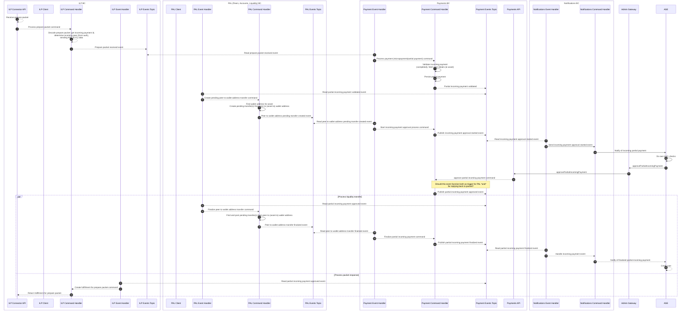

# Remote Outgoing Payment - Receiving

```mermaid
sequenceDiagram
	autonumber


    box ILP BC
    participant ILPAPI as ILP Connector API
    participant ILPC as ILP Client
	participant ILP as ILP Command Handler
    participant ILPEH as ILP Event Handler
    participant ILPET as ILP Events Topic
    end

    box PAL (Peers, Accounts, Liquidity) BC
    participant PALC as PAL Client
    participant PALEH as PAL Event Handler
    participant PALCH as PAL Command Handler
    participant PALET as PAL Events Topic
    end

    box Payments BC
	participant PEH as Payment Event Handler
    participant PCH as Payment Command Handler
    participant PET as Payment Events Topic
    participant PAPI as Payments API
    end

    box Notifications BC
    participant NEH as Notifications Event Handler
    participant NCH as Notifications Command Handler
    end

    participant AGW as Admin Gateway
    participant ASE as ASE


    ILPAPI-->>ILPAPI: Receive prepare packet
    ILPAPI -->> ILP: Process prepare packet command
    %% Or we decode in the ILPAPI
    ILP-->>ILP: Decode prepare packet: get incoming payment id,<br>determine incoming peer (from auth), <br> sending ASE (KYC) data
    ILP-->>ILPET: Prepare packet received event
    %% We need the FX data.
    PEH -->> ILPET: Read prepare packet received event
    PEH -->> PCH: Process payment (micropayment/partial payment) command
    PCH ->> PCH: Validate incoming payment <br> (completed), fetch peer details (ie asset)
    PCH ->> PCH: Persist partial payment
    PCH -->> PET: Partial incoming payment validated
    PALEH -->> PET: Read partial incoming payment validated event
    PALEH -->> PALCH: Create pending peer to wallet address transfer command
    PALCH ->>PALCH: Find wallet address for asset<br> Create pending transfer(s) from peer to (asset to) wallet address
    PALCH -->> PALET: Peer to wallet address pending transfer created event
    PEH -->> PALET: Read peer to wallet address pending transfer created event
    PEH -->> PCH: Start incoming payment approval process command
    PCH -->> PET: Publish incoming payment approval started event

    NEH -->> PET: Read incoming payment approval started event
    NEH ->> NCH: Send incoming payment approval started event
    NCH ->> ASE: Notify of incoming partial payment
    ASE ->> ASE: Do own KYC checks
    ASE ->> AGW: approvePartialIncomingPayment
    AGW ->> PAPI: approvePartialIncomingPayment
    PAPI -->> PCH: approve partial incoming payment command
    Note over PCH, PET: Should this event function both as trigger for PAL *and* <br>for replying back to packet?
    PCH -->> PET: Publish partial incoming payment approved event
    par Process liquidity transfer

    PALEH -->> PET: Read partial incoming payment approved event
    PALEH -->> PALCH: Finalize peer to wallet address transfer command
    PALCH ->>PALCH: Find and post pending transfer(s) from peer to (asset to) wallet address
    PALCH -->> PALET: Peer to wallet address transfer finalized event
    PEH -->> PALET: Read peer to wallet address transfer finalized event
    PEH -->> PCH: Finalize partial incoming payment command
    PCH -->> PET: Publish partial incoming payment finalized event
    NEH -->> PET: Read partial incoming payment finalized event
    NEH -->> NCH: Handle incoming payment event
    NCH -->> ASE: Notify of finalized partial incoming payment
    ASE -->> ASE: Credit user


    and Process packet response
    ILPEH -->> PET: Read partial incoming payment approved event
    ILPEH -->> ILP: Create fulfillment for prepare packet command
    ILP -->> ILPAPI: Return fulfillment for prepare packet


    end
```
