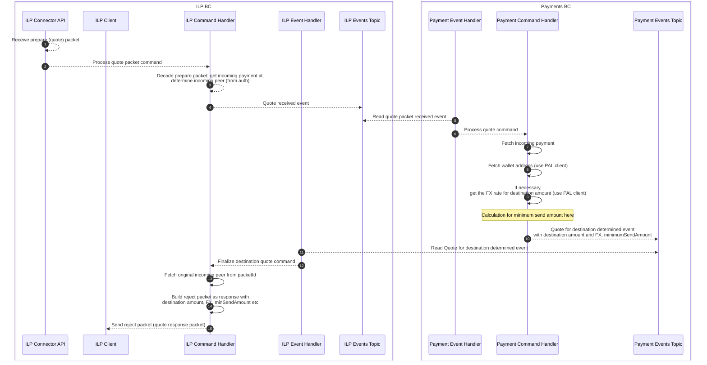

# Remote Quote - Receiving

```mermaid
sequenceDiagram
	autonumber


    box ILP BC
    participant ILPAPI as ILP Connector API
    participant ILPC as ILP Client
	participant ILP as ILP Command Handler
    participant ILPEH as ILP Event Handler
    participant ILPET as ILP Events Topic
    end

    %% box PAL (Peers, Accounts, Liquidity) BC
    %% participant PALEH as Accounts & Liquidity Event Handler
    %% participant PALCH as Accounts & Liquidity Command Handler
    %% participant PALET as Accounts & Liquidity Events Topic
    %% end

    box Payments BC
	participant PEH as Payment Event Handler
    participant PCH as Payment Command Handler
    participant PET as Payment Events Topic
    end


    ILPAPI-->>ILPAPI: Receive prepare (quote) packet
    ILPAPI -->> ILP: Process quote packet command
    %% Or we decode in the ILPAPI
    ILP-->>ILP: Decode prepare packet: get incoming payment id,<br>determine incoming peer (from auth)
    ILP-->>ILPET: Quote received event
    PEH -->> ILPET: Read quote packet received event
    PEH -->> PCH: Process quote command
    PCH ->> PCH: Fetch incoming payment
    PCH ->> PCH: Fetch wallet address (use PAL client)
    PCH ->> PCH: If necessary, <br>get the FX rate for destination amount (use PAL client)
    Note over PCH: Calculation for minimum send amount here
    PCH -->> PET: Quote for destination determined event<br>with destination amount and FX, minimumSendAmount
    ILPEH -->> PET: Read Quote for destination determined event
    ILPEH -->> ILP: Finalize destination quote command
    ILP ->> ILP: Fetch original incoming peer from packetId
    ILP ->> ILP: Build reject packet as response with <br>destination amount, FX, minSendAmount etc
    ILP -->> ILPC: Send reject packet (quote response packet)


    %% PALCH ->> PALCH: If necessary, get the FX rate for destination amount
    %% PEH -->> PCH: Process prepare packet command
    %% PCH->>PCH: Validate incoming payment <br> (completed), fetch peer details (ie asset)
    %%
```
