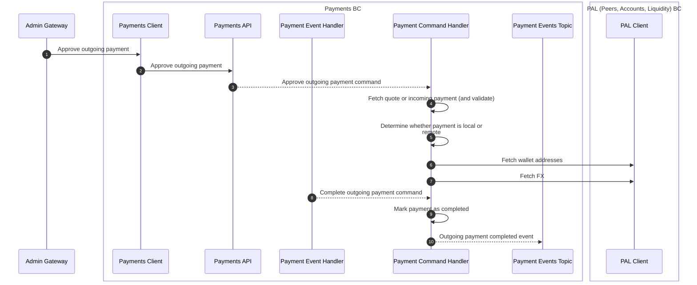

# Making Local Payments

```mermaid
sequenceDiagram
	autonumber

    participant AGW as Admin Gateway
	
    box Payments BC
    
	participant PC as Payments Client
	participant PAPI as Payments API
	participant PEH as Payment Event Handler
    participant PCH as Payment Command Handler
    participant PET as Payment Events Topic
    end
    
    box PAL (Peers, Accounts, Liquidity) BC
    participant PALC as PAL Client
    end

    AGW ->>PC: Approve outgoing payment
    PC ->> PAPI: Approve outgoing payment
    PAPI -->> PCH: Approve outgoing payment command
    PCH ->> PCH: Fetch quote or incoming payment (and validate)
	PCH ->> PCH: Determine whether payment is local or <br> remote
    PCH ->> PALC: Fetch wallet addresses
    PCH ->> PALC: Fetch FX
    PEH -->> PCH: Complete outgoing payment command
    PCH ->> PCH: Mark payment as completed
    PCH -->> PET: Outgoing payment completed event
```