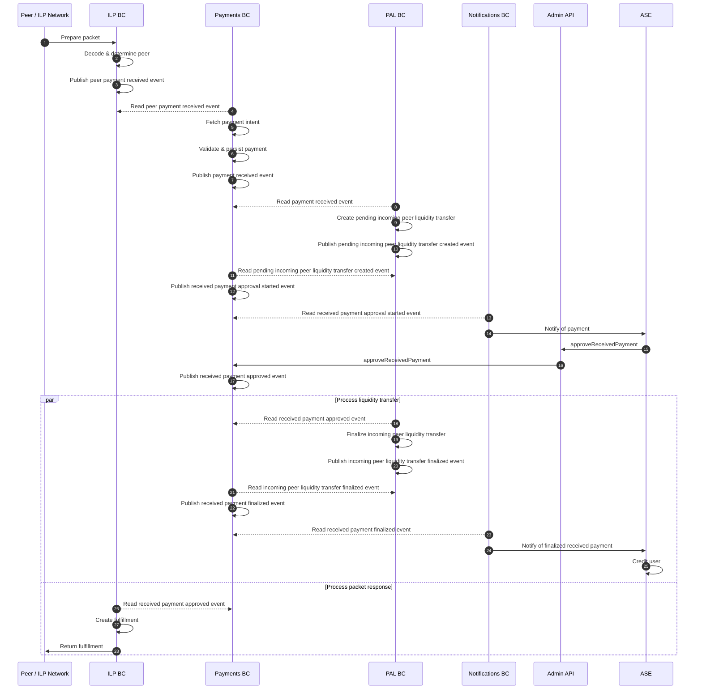

# Remote Outgoing Payment - Receiving

```mermaid
sequenceDiagram
	autonumber


    participant Peer as Peer / ILP Network
    participant ILPBC as ILP BC
    participant PBC as Payments BC
    participant PAL as PAL BC
    participant NBC as Notifications BC
    participant AAPI as Admin API
    participant ASE as ASE

    Peer ->> ILPBC: Prepare packet
    ILPBC ->> ILPBC: Decode & determine peer
    ILPBC ->> ILPBC: Publish peer payment received event

    PBC -->> ILPBC: Read peer payment received event
    PBC ->> PBC: Fetch payment intent
    PBC ->> PBC: Validate & persist payment
    PBC ->> PBC: Publish payment received event

    PAL -->> PBC: Read payment received event
    PAL ->> PAL: Create pending incoming peer liquidity transfer
    PAL ->> PAL: Publish pending incoming peer liquidity transfer created event

    PBC -->> PAL: Read pending incoming peer liquidity transfer created event
    PBC ->> PBC: Publish received payment approval started event

    NBC -->> PBC: Read received payment approval started event
    NBC ->> ASE: Notify of payment
    ASE ->> AAPI: approveReceivedPayment
    AAPI ->> PBC: approveReceivedPayment

    PBC ->> PBC: Publish received payment approved event

    par Process liquidity transfer
    PAL -->> PBC: Read received payment approved event
    PAL ->> PAL: Finalize incoming peer liquidity transfer
    PAL ->> PAL: Publish incoming peer liquidity transfer finalized event

    PBC -->> PAL: Read incoming peer liquidity transfer finalized event
    PBC ->> PBC: Publish received payment finalized event

    NBC -->> PBC: Read received payment finalized event
    NBC ->> ASE: Notify of finalized received payment
    ASE ->> ASE: Credit user
    and Process packet response
    ILPBC -->> PBC: Read received payment approved event
    ILPBC ->> ILPBC: Create fulfillment
    ILPBC ->> Peer: Return fulfillment
    end
```
