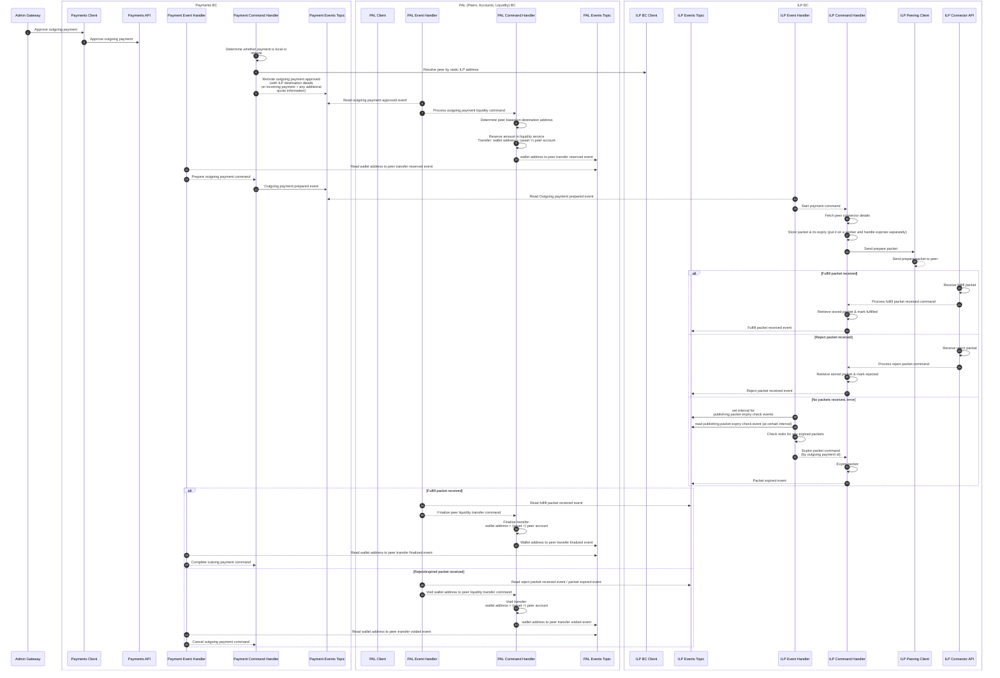

# Remote Outgoing Payment - Sending

```mermaid
sequenceDiagram
	autonumber

    participant AGW as Admin Gateway

    box Payments BC
	participant PC as Payments Client
	participant PAPI as Payments API
	participant PEH as Payment Event Handler
    participant PCH as Payment Command Handler
    participant PET as Payment Events Topic
    end

    box PAL (Peers, Accounts, Liquidity) BC
    participant PALC as PAL Client
    participant PALEH as PAL Event Handler
    participant PALCH as PAL Command Handler
    participant PALET as PAL Events Topic
    end

    box ILP BC
    participant ILPBCC as ILP BC Client
    participant ILPET as ILP Events Topic
    participant ILPEH as ILP Event Handler
	participant ILP as ILP Command Handler
    participant ILPC as ILP Peering Client
    participant ILPAPI as ILP Connector API
    end


    AGW ->> PC: Approve outgoing payment
    PC ->> PAPI: Approve outgoing payment
	PCH ->> PCH: Determine whether payment is local or <br> remote
    PCH ->> ILPBCC: Resolve peer by static ILP address
    PCH -->> PET: Remote outgoing payment approved <br> (with ILP destination details <br> on incoming payment + any additional <br>quote information)
    PALEH -->> PET: Read outgoing payment approved event
    PALEH -->> PALCH: Process outgoing payment liquidity command
    PALCH ->>PALCH: Determine peer based on destination address
    PALCH ->>PALCH: Reserve amount in liquidity service <br> Transfer: wallet address > (asset >) peer account
    PALCH -->>PALET: wallet address to peer transfer reserved event
    PEH -->> PALET: Read wallet address to peer transfer reserved event
	PEH -->> PCH: Prepare outgoing payment command
    PCH ->> PET: Outgoing payment prepared event
    ILPEH -->> PET: Read Outgoing payment prepared event
    ILPEH -->> ILP: Start payment command
    ILP ->> ILP: Fetch peer connector details
    ILP ->> ILP: Store packet & its expiry (put it on a worker and handle expiries separately)

    ILP ->> ILPC: Send prepare packet
    ILPC -->> ILPC: Send prepare packet to peer
    alt Fulfill packet received
    ILPAPI ->> ILPAPI: Receive fulfill packet
    ILPAPI -->> ILP: Process fulfill packet received command
    ILP ->>ILP: Retrieve stored packet & mark fulfilled
    %% ILP -->> ILP: Finalize liquidity transfer
    ILP -->> ILPET: Fulfill packet received event

    else Reject packet received
    ILPAPI ->> ILPAPI: Receive reject packet
    ILPAPI -->> ILP: Process reject packet command
    ILP ->>ILP: Retrieve stored packet & mark rejected
    ILP -->> ILPET: Reject packet received event
    else No packets received, error
    ILPEH ->> ILPET: set interval for <br>publishing packet expiry check events
    ILPEH ->> ILPET: read publishing packet expiry check event (at certain interval)
    ILPEH ->> ILPEH: Check redis for any expired packets
    ILPEH -->> ILP: Expire packet command <br>(by outgoing payment id)
    ILP ->>ILP: Expire packet
    ILP -->> ILPET: Packet expired event
    end
    alt Fulfill packet received
    PALEH -->> ILPET: Read fulfill packet received event
    PALEH -->> PALCH: Finalize peer liquidity transfer command
    PALCH ->>PALCH: Finalize transfer:  <br> wallet address > (asset >) peer account
    PALCH -->> PALET: Wallet address to peer transfer finalized event
    PEH -->> PALET: Read wallet address to peer transfer finalized event
    PEH -->> PCH: Complete outoing payment command
    else Reject/expired packet received
    PALEH -->> ILPET: Read reject packet received event / packet expired event
    PALEH -->> PALCH: Void wallet address to peer liquidity transfer command
    PALCH ->>PALCH: Void transfer:  <br> wallet address > (asset >) peer account
    PALCH -->> PALET: wallet address to peer transfer voided event
    PEH -->> PALET: Read wallet address to peer transfer voided event
    PEH -->> PCH: Cancel outgoing payment command
    end
```
