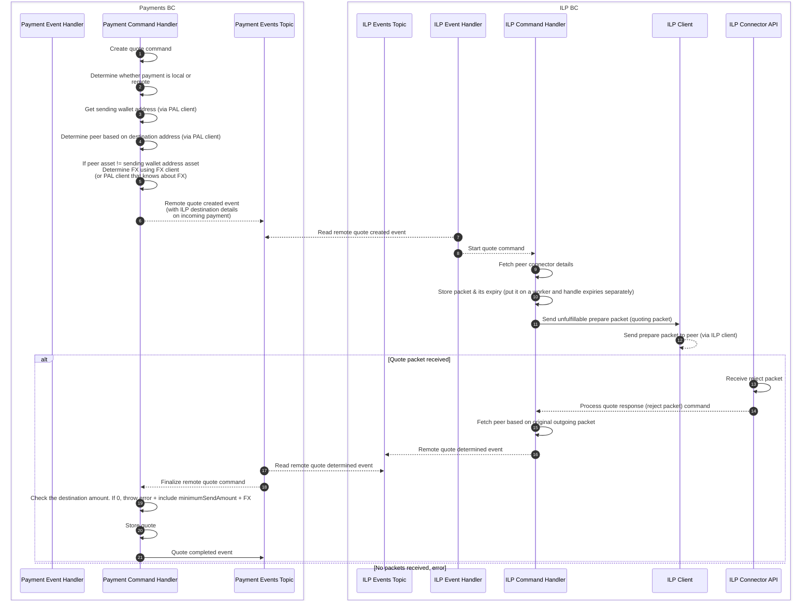

# Remote Quote - Sending

```mermaid
sequenceDiagram
	autonumber

    box Payments BC

	participant PEH as Payment Event Handler
    participant PCH as Payment Command Handler
    participant PET as Payment Events Topic
    end

    box ILP BC
    participant ILPET as ILP Events Topic
    participant ILPEH as ILP Event Handler
	participant ILP as ILP Command Handler
    participant ILPC as ILP Client
    participant ILPAPI as ILP Connector API
    end


    PCH ->> PCH: Create quote command
	PCH ->> PCH: Determine whether payment is local or <br> remote
    PCH ->> PCH: Get sending wallet address (via PAL client)
    PCH ->> PCH: Determine peer based on destination address (via PAL client)
    PCH ->> PCH: If peer asset != sending wallet address asset <br> Determine FX using FX client <br> (or PAL client that knows about FX)
    PCH -->> PET: Remote quote created event <br> (with ILP destination details <br> on incoming payment)

    ILPEH -->> PET: Read remote quote created event
    ILPEH -->> ILP: Start quote command
    ILP ->> ILP: Fetch peer connector details
    ILP ->> ILP: Store packet & its expiry (put it on a worker and handle expiries separately)

    ILP ->> ILPC: Send unfulfillable prepare packet (quoting packet)
    ILPC -->> ILPC: Send prepare packet to peer (via ILP client)

    alt Quote packet received
    ILPAPI ->> ILPAPI: Receive reject packet
    ILPAPI -->> ILP: Process quote response (reject packet) command
    ILP ->> ILP: Fetch peer based on original outgoing packet
    ILP -->> ILPET: Remote quote determined event
    PET -->> ILPET : Read remote quote determined event
    PET -->> PCH: Finalize remote quote command
    PCH ->> PCH: Check the destination amount. If 0, throw error + include minimumSendAmount + FX
    PCH ->> PCH: Store quote
    PCH ->> PET: Quote completed event

    else No packets received, error
    end
```
