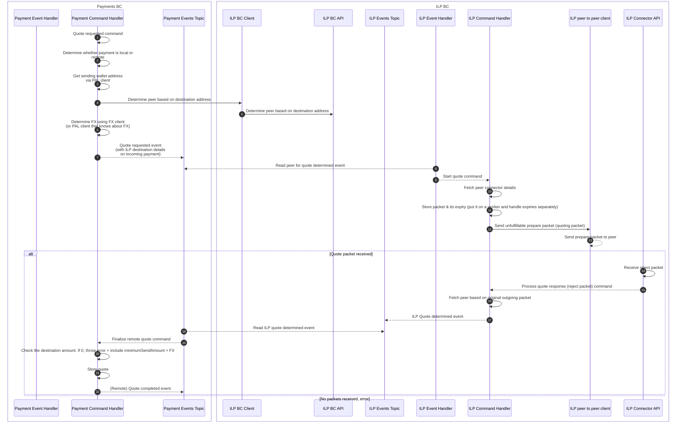

# Remote Quote - Sending

```mermaid
sequenceDiagram
	autonumber

    box Payments BC

	participant PEH as Payment Event Handler
    participant PCH as Payment Command Handler
    participant PET as Payment Events Topic
    end

    box ILP BC
    participant ILPC as ILP BC Client
    participant ILPAPI as ILP BC API
    participant ILPET as ILP Events Topic
    participant ILPEH as ILP Event Handler
	participant ILP as ILP Command Handler
    participant ILPPC as ILP peer to peer client
    participant ILPCAPI as ILP Connector API
    end


    PCH ->> PCH: Quote requested command
	PCH ->> PCH: Determine whether payment is local or <br> remote
    PCH ->> PCH: Get sending wallet address <br> via PAL client
    PCH ->> ILPC: Determine peer based on destination address
    ILPC ->> ILPAPI: Determine peer based on destination address
    PCH ->> PCH: Determine FX using FX client <br> (or PAL client that knows about FX)
    PCH -->> PET: Quote requested event <br> (with ILP destination details <br> on incoming payment)

    ILPEH -->> PET: Read peer for quote determined event
    ILPEH -->> ILP: Start quote command
    ILP ->> ILP: Fetch peer connector details
    ILP ->> ILP: Store packet & its expiry (put it on a worker and handle expiries separately)

    ILP ->> ILPPC: Send unfulfillable prepare packet (quoting packet)
    ILPPC -->> ILPPC: Send prepare packet to peer

    alt Quote packet received
    ILPCAPI ->> ILPCAPI: Receive reject packet
    ILPCAPI -->> ILP: Process quote response (reject packet) command
    ILP ->> ILP: Fetch peer based on original outgoing packet
    ILP -->> ILPET: ILP Quote determined event
    PET -->> ILPET : Read ILP quote determined event
    PET -->> PCH: Finalize remote quote command
    PCH ->> PCH: Check the destination amount. If 0, throw error + include minimumSendAmount + FX
    PCH ->> PCH: Store quote
    PCH -->> PET: (Remote) Quote completed event

    else No packets received, error
    end
```
