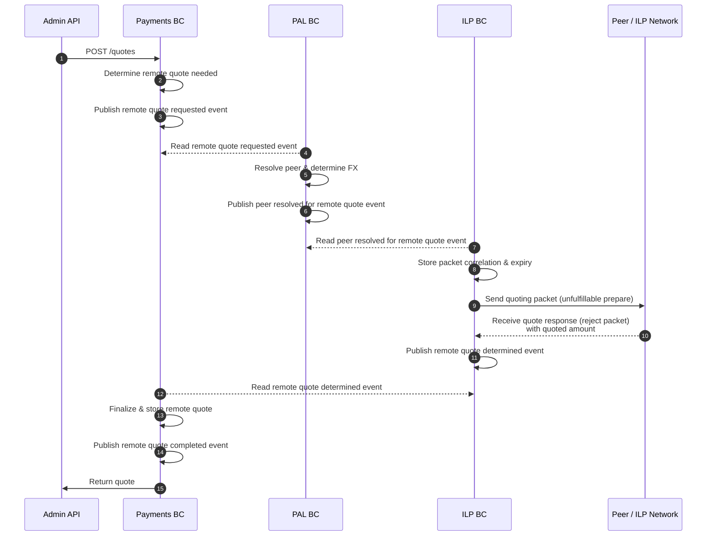

# Remote Quote - Sending

```mermaid
sequenceDiagram
	autonumber

    participant AAPI as Admin API
    participant PBC as Payments BC
    participant PAL as PAL BC
    participant ILPBC as ILP BC
    participant Peer as Peer / ILP Network

    AAPI ->> PBC: POST /quotes
    PBC ->> PBC: Determine remote quote needed
    PBC ->> PBC: Publish remote quote requested event

    PAL -->> PBC: Read remote quote requested event
    PAL ->> PAL: Resolve peer & determine FX
    PAL ->> PAL: Publish peer resolved for remote quote event

    ILPBC -->> PAL: Read peer resolved for remote quote event
    ILPBC ->> ILPBC: Store packet correlation & expiry
    ILPBC ->> Peer: Send quoting packet (unfulfillable prepare)
    Peer -->> ILPBC: Receive quote response (reject packet) <br> with quoted amount
    ILPBC ->> ILPBC: Publish remote quote determined event

    PBC -->> ILPBC: Read remote quote determined event
    PBC ->> PBC: Finalize & store remote quote
    PBC ->> PBC: Publish remote quote completed event
    PBC ->> AAPI: Return quote
```
